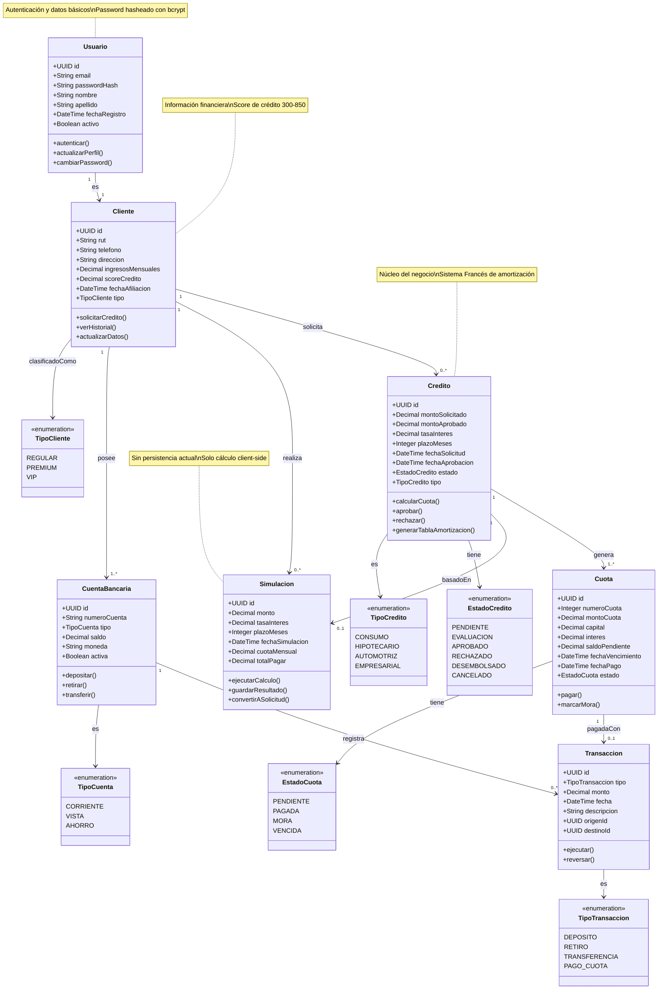
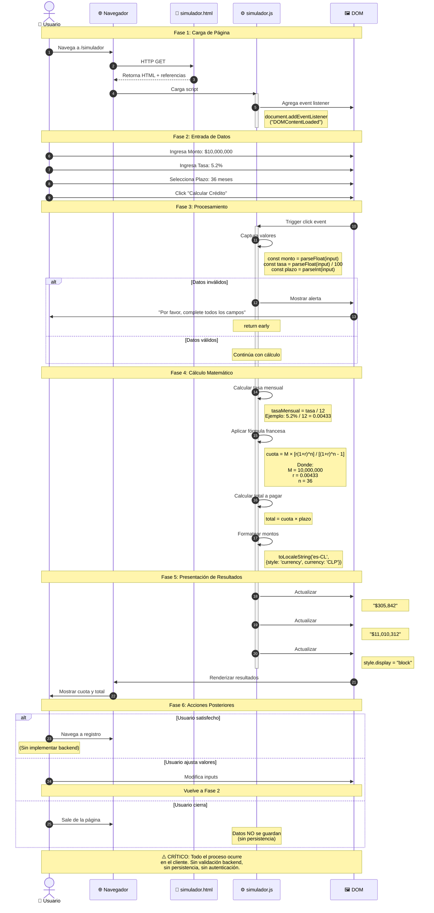

# 🏗️ ANÁLISIS ARQUITECTÓNICO - USMBANK (AURORA PRIVÉ)

**Autor:** Arquitecto de Software Senior
**Fecha:** 2025-11-24
**Aplicación:** Sistema Bancario UsmBank - Aurora Privé

---

## 📋 ÍNDICE

1. [Patrón de Arquitectura](#1-patrón-de-arquitectura)
2. [Componentes Principales](#2-componentes-principales)
3. [Flujo de Datos](#3-flujo-de-datos)
4. [Diagramas](#4-diagramas)
5. [Análisis Crítico](#5-análisis-crítico)
6. [Recomendaciones](#6-recomendaciones)

---

## 1. PATRÓN DE ARQUITECTURA

### **Patrón Identificado: MONOLITO EN 3 CAPAS (Incompleto)**

```
┌─────────────────────────────────────────────┐
│           FRONTEND (React + TS)             │
│  - Single Page Application                  │
│  - Componentes React                        │
│  - Lógica de negocio en cliente            │
└─────────────────┬───────────────────────────┘
                  │ (Sin comunicación real)
┌─────────────────▼───────────────────────────┐
│        BACKEND (Express.js/Node.js)         │
│  - Servidor de archivos estáticos          │
│  - Sin API REST implementada                │
│  - Sin lógica de negocio                    │
└─────────────────┬───────────────────────────┘
                  │ (Configurado pero no usado)
┌─────────────────▼───────────────────────────┐
│       BASE DE DATOS (PostgreSQL 15)         │
│  - Contenedor activo                        │
│  - Sin esquema definido                     │
│  - Sin conexiones reales                    │
└─────────────────────────────────────────────┘
```

### **Características Arquitectónicas:**

#### ✅ **Presente:**
- **Monolito:** Todo el código en un solo repositorio
- **Contenerización:** Docker + Docker Compose
- **Separación Frontend/Backend:** Física pero no lógica
- **Client-Side Rendering:** React SPA

#### ❌ **Ausente:**
- **API REST:** No hay endpoints de datos
- **Capa de Servicios:** Lógica de negocio inexistente
- **Capa de Persistencia:** Base de datos no utilizada
- **Controladores:** Rutas directas sin handlers
- **Middleware:** Sin autenticación, validación ni manejo de errores

### **Conclusión Arquitectónica:**

> **Esta aplicación es un PROTOTIPO ESTÁTICO** que simula ser una aplicación bancaria, pero actualmente solo funciona como un sitio web con cálculos del lado del cliente. No implementa los patrones arquitectónicos necesarios para una aplicación empresarial real.

---

## 2. COMPONENTES PRINCIPALES

### **2.1 CAPA DE PRESENTACIÓN (Frontend)**

#### **Actores Identificados:**

1. **Usuario Anónimo** → Visitante del sitio web
2. **Usuario Potencial** → Intenta registrarse/iniciar sesión
3. **Cliente Bancario** → Usuario autenticado (simulado)

#### **Componentes React (home.tsx):**

```typescript
// Componente principal
- App()
  ├── Header()
  │   ├── Logo
  │   ├── NavigationMenu
  │   └── MobileMenuButton
  ├── HeroSection()
  │   ├── Title & Subtitle
  │   ├── CTAButton
  │   └── HeroImage
  ├── StatsSection()
  │   └── StatCard[] (4 estadísticas)
  ├── AuthenticationPanel()
  │   ├── LoginForm
  │   ├── SignupForm
  │   └── ToastNotification
  ├── AssurancesSection()
  │   └── AssuranceCard[] (3 garantías)
  └── Footer()
      ├── Branding
      ├── FooterLinks
      └── Disclaimer
```

#### **Módulos Independientes:**

1. **Simulador de Créditos** (`simulador.js`)
   - **Función:** Calcular cuotas de préstamos
   - **Algoritmo:** Sistema Francés de Amortización
   - **Inputs:** Monto, Tasa de Interés, Plazo
   - **Outputs:** Cuota mensual, Total a pagar

2. **Gestor de Autenticación** (`home.tsx`)
   - **Función:** Simular login/registro
   - **Estado:** Local (React useState)
   - **Resultado:** Notificaciones toast

### **2.2 CAPA DE APLICACIÓN (Backend)**

#### **Servidor Express (index.js):**

```javascript
Responsabilidades:
├── Servir archivos estáticos (HTML, CSS, JS)
├── Enrutar solicitudes HTTP
└── Inicializar servidor en puerto 3000

Rutas:
├── GET  /           → index.html (Landing page)
├── GET  /simulador  → simulador.html (Calculadora)
└── GET  /public/*   → Archivos estáticos
```

**Tareas Actuales:**
- ✅ Servir contenido estático
- ❌ Procesar lógica de negocio
- ❌ Validar datos
- ❌ Gestionar sesiones
- ❌ Interactuar con base de datos

### **2.3 CAPA DE DATOS (PostgreSQL)**

#### **Base de Datos (db.js):**

```javascript
Estado: CONFIGURADA PERO NO UTILIZADA

Configuración:
├── Host: postgres_db (contenedor Docker)
├── Puerto: 5432
├── Usuario: user
├── Contraseña: password
└── Base de datos: mydb

Pool de conexiones: CREADO PERO NUNCA INVOCADO
```

**Esquema:** No definido
**Migraciones:** No existen
**Queries:** Ninguna implementada

### **2.4 INFRAESTRUCTURA (Docker)**

```yaml
Servicios:
├── app (Node.js)
│   ├── Puerto: 3000
│   ├── Dependencia: postgres_db
│   └── Sincronización: wait-port
│
└── postgres_db
    ├── Imagen: postgres:15-alpine
    ├── Puerto: 5432
    └── Volumen: postgres_data (persistente)
```

---

## 3. FLUJO DE DATOS

### **3.1 FLUJO ACTUAL (Simulador de Créditos)**

El proceso más importante de la aplicación es la **simulación de crédito premium**, ya que es el único que ejecuta lógica de negocio real:

```
[Usuario] → [Navegador] → [Simulador.html]
                             ↓
                    [simulador.js]
                             ↓
                    ┌────────────────┐
                    │ Captura Input  │
                    │ - Monto        │
                    │ - Tasa         │
                    │ - Plazo        │
                    └────────┬───────┘
                             ↓
                    ┌────────────────────┐
                    │ Cálculo Local      │
                    │ (Sistema Francés)  │
                    │                    │
                    │ cuota = M × (r × (1+r)^n)
                    │         ─────────────
                    │          (1+r)^n - 1│
                    └────────┬───────────┘
                             ↓
                    ┌────────────────┐
                    │ Renderizar     │
                    │ Resultados     │
                    │ en DOM         │
                    └────────────────┘
                             ↓
                        [Usuario ve
                         resultado]
```

**Características del Flujo:**
- **100% Cliente:** Sin comunicación con servidor
- **Sin Persistencia:** Resultados no se guardan
- **Cálculo Instantáneo:** Sin latencia de red
- **Sin Validación Backend:** Vulnerable a manipulación

### **3.2 FLUJO ESPERADO (Autenticación - No Implementado)**

Así **debería** funcionar el login/registro:

```
┌─────────┐      HTTPS        ┌──────────┐      SQL       ┌──────────┐
│         │  ───────────────> │          │ ─────────────> │          │
│ Browser │   POST /api/auth  │ Express  │ SELECT/INSERT  │ Postgres │
│         │  <─────────────── │          │ <───────────── │          │
└─────────┘   JSON + JWT      └──────────┘   Rows/Error   └──────────┘
    │                               │                          │
    │                               │                          │
    ▼                               ▼                          ▼
1. User ingresa                2. Valida datos            3. Verifica
   credenciales                3. Hash password              usuario existe
2. Click Submit                4. Consulta DB             4. Retorna datos
                               5. Genera JWT
                               6. Envía respuesta
    │                               │
    ▼                               ▼
4. Recibe JWT                  7. Usuario autenticado
5. Guarda en localStorage      8. Redirige a dashboard
6. Actualiza UI
```

**REALIDAD ACTUAL:**

```
┌─────────┐
│ Browser │  [Click Login]
│         │       ↓
│         │  handleSubmit()
│         │       ↓
│         │  event.preventDefault()
│         │       ↓
│         │  showToast("Cuenta activada")
│         │       ↓
└─────────┘  [FIN - Sin validación real]
```

### **3.3 DIAGRAMA DE FLUJO DE DATOS (Estado Actual)**

```
┌────────────────────────────────────────────────────────────┐
│                      NAVEGADOR (Cliente)                    │
│                                                             │
│  ┌──────────────┐         ┌──────────────┐                │
│  │   index.html │         │simulador.html│                │
│  └──────┬───────┘         └──────┬───────┘                │
│         │                        │                         │
│         ▼                        ▼                         │
│  ┌──────────────┐         ┌──────────────┐                │
│  │   home.js    │         │simulador.js  │                │
│  │  (React App) │         │ (Calculator) │                │
│  └──────────────┘         └──────────────┘                │
│         │                        │                         │
│         └────────┬───────────────┘                         │
│                  │                                         │
│        [Toda la lógica vive aquí]                         │
│        [Sin comunicación con backend]                      │
└────────────────────┬───────────────────────────────────────┘
                     │
                     │ HTTP GET (solo archivos estáticos)
                     │
┌────────────────────▼───────────────────────────────────────┐
│                    SERVIDOR EXPRESS                         │
│                                                             │
│  ┌──────────────────────────────────────────────────┐     │
│  │  app.use(express.static('public'))               │     │
│  │  app.get('/', send index.html)                   │     │
│  │  app.get('/simulador', send simulador.html)      │     │
│  └──────────────────────────────────────────────────┘     │
│                                                             │
│  ┌──────────────────────────────────────────────────┐     │
│  │  db.js (Pool configurado pero NUNCA usado)       │     │
│  └──────────────────────────────────────────────────┘     │
└────────────────────┬───────────────────────────────────────┘
                     │
                     │ (Sin conexiones)
                     │
┌────────────────────▼───────────────────────────────────────┐
│                  POSTGRESQL 15                              │
│                                                             │
│  ┌──────────────────────────────────────────────────┐     │
│  │  Base de datos: mydb                             │     │
│  │  Estado: VACÍA                                   │     │
│  │  Esquema: NO DEFINIDO                            │     │
│  └──────────────────────────────────────────────────┘     │
└─────────────────────────────────────────────────────────────┘
```

### **3.4 ANÁLISIS DEL FLUJO:**

| Aspecto | Estado | Evaluación |
|---------|--------|------------|
| **Frontend → Backend** | ❌ No implementado | Sin API calls |
| **Backend → Base de Datos** | ❌ No implementado | Pool sin usar |
| **Validación de Datos** | ❌ Solo cliente | Inseguro |
| **Persistencia** | ❌ No existe | Datos volátiles |
| **Autenticación** | ❌ Simulada | Sin JWT/sesiones |
| **Manejo de Errores** | ❌ Ausente | Sin try-catch |

---

## 4. DIAGRAMAS

### **4.1 DIAGRAMA DE CLASES (Dominio Bancario)**



### **4.2 DIAGRAMA DE SECUENCIA (Proceso de Simulación de Crédito)**

Este es el proceso más importante implementado actualmente:



### **4.3 DIAGRAMA DE SECUENCIA (Flujo de Autenticación Ideal - No Implementado)**

Para contraste, así **debería** funcionar:

```mermaid
sequenceDiagram
    autonumber
    actor Usuario as 👤 Usuario
    participant Browser as 🌐 React App
    participant API as 🔌 Express API
    participant Auth as 🔐 Auth Service
    participant DB as 🗄️ PostgreSQL
    participant Cache as 💾 Redis

    %% REGISTRO
    Note over Usuario,Cache: Proceso: Registro de Usuario
    Usuario->>Browser: Ingresa email + password
    Browser->>Browser: Valida formato (regex)

    Browser->>API: POST /api/auth/signup
    Note right of Browser: {email, password, nombre}

    API->>Auth: validateInput(data)
    Auth->>Auth: Validar formato email
    Auth->>Auth: Validar fortaleza password

    alt Validación falla
        Auth-->>API: Error 400
        API-->>Browser: {error: "Datos inválidos"}
        Browser->>Usuario: Mostrar error
    else Validación exitosa
        Auth->>DB: SELECT * FROM usuarios WHERE email = ?

        alt Usuario ya existe
            DB-->>Auth: Usuario encontrado
            Auth-->>API: Error 409
            API-->>Browser: {error: "Email ya registrado"}
            Browser->>Usuario: Mostrar error
        else Usuario nuevo
            Auth->>Auth: hashPassword(password)
            Note right of Auth: bcrypt.hash(pwd, 10)

            Auth->>DB: BEGIN TRANSACTION
            Auth->>DB: INSERT INTO usuarios
            Auth->>DB: INSERT INTO clientes
            DB-->>Auth: Usuario creado (id: UUID)
            Auth->>DB: COMMIT

            Auth->>Auth: generateJWT(userId)
            Note right of Auth: jwt.sign({id, email},<br/>SECRET, {expiresIn: '24h'})

            Auth-->>API: {token, usuario}
            API-->>Browser: 201 Created
            Browser->>Browser: localStorage.setItem('token', jwt)
            Browser->>Usuario: Redirigir a /dashboard
        end
    end

    %% LOGIN
    Note over Usuario,Cache: Proceso: Inicio de Sesión
    Usuario->>Browser: Ingresa email + password
    Browser->>API: POST /api/auth/login

    API->>Cache: CHECK_RATE_LIMIT(ip)

    alt Demasiados intentos
        Cache-->>API: Rate limit exceeded
        API-->>Browser: 429 Too Many Requests
        Browser->>Usuario: "Intente en 15 minutos"
    else Rate limit OK
        API->>Auth: authenticateUser(email, pwd)
        Auth->>DB: SELECT * FROM usuarios WHERE email = ?

        alt Usuario no existe
            DB-->>Auth: NULL
            Auth-->>API: Error 401
            API-->>Browser: {error: "Credenciales inválidas"}
        else Usuario existe
            DB-->>Auth: {id, email, passwordHash, activo}

            alt Cuenta inactiva
                Auth-->>API: Error 403
                API-->>Browser: {error: "Cuenta desactivada"}
            else Cuenta activa
                Auth->>Auth: bcrypt.compare(pwd, hash)

                alt Password incorrecta
                    Auth->>DB: INCREMENT login_attempts
                    Auth-->>API: Error 401
                    API-->>Browser: {error: "Credenciales inválidas"}
                else Password correcta
                    Auth->>DB: UPDATE last_login = NOW()
                    Auth->>DB: RESET login_attempts

                    Auth->>Auth: generateJWT(userId)
                    Auth->>Cache: STORE_SESSION(token, userId)
                    Note right of Cache: TTL: 24 horas

                    Auth-->>API: {token, usuario}
                    API-->>Browser: 200 OK
                    Browser->>Browser: localStorage.setItem('token', jwt)
                    Browser->>Usuario: Redirigir a /dashboard
                end
            end
        end
    end

    %% ACCESO A RECURSOS PROTEGIDOS
    Note over Usuario,Cache: Proceso: Acceso a Recurso Protegido
    Usuario->>Browser: Solicita simular crédito
    Browser->>API: GET /api/simulaciones
    Note right of Browser: Authorization: Bearer <token>

    API->>Auth: validateToken(token)
    Auth->>Cache: CHECK_TOKEN(token)

    alt Token en caché
        Cache-->>Auth: {userId, email}
    else Token no en caché
        Auth->>Auth: jwt.verify(token, SECRET)

        alt Token inválido/expirado
            Auth-->>API: Error 401
            API-->>Browser: {error: "Token inválido"}
            Browser->>Usuario: Redirigir a /login
        else Token válido
            Auth->>DB: SELECT * FROM usuarios WHERE id = ?
            DB-->>Auth: Usuario activo
            Auth->>Cache: STORE_TOKEN(token, userId)
        end
    end

    API->>DB: SELECT * FROM simulaciones WHERE usuario_id = ?
    DB-->>API: Lista de simulaciones
    API-->>Browser: 200 OK + data
    Browser->>Usuario: Mostrar simulaciones

    Note over Usuario,Cache: ⚠️ ESTADO ACTUAL: Nada de esto<br/>está implementado. Solo existe UI.
```



---

## 5. ANÁLISIS CRÍTICO

### **5.1 FORTALEZAS**

| Aspecto | Evaluación | Detalle |
|---------|------------|---------|
| **UI/UX** | ⭐⭐⭐⭐ | Diseño moderno y responsive |
| **Contenerización** | ⭐⭐⭐⭐⭐ | Docker correctamente configurado |
| **TypeScript** | ⭐⭐⭐⭐ | Tipado estático en frontend |
| **React Moderno** | ⭐⭐⭐⭐ | Hooks y componentes funcionales |
| **Separación Frontend** | ⭐⭐⭐ | Código organizado |

### **5.2 DEBILIDADES CRÍTICAS**

| Problema | Severidad | Impacto |
|----------|-----------|---------|
| **Sin API REST** | 🔴 CRÍTICO | No hay backend funcional |
| **Base de datos sin usar** | 🔴 CRÍTICO | Sin persistencia |
| **Autenticación simulada** | 🔴 CRÍTICO | Sin seguridad real |
| **Sin validación backend** | 🔴 CRÍTICO | Vulnerable a manipulación |
| **Sin manejo de errores** | 🟠 ALTO | Experiencia de usuario pobre |
| **Sin testing** | 🟠 ALTO | Código no probado |
| **Mezcla de módulos** | 🟡 MEDIO | CommonJS + ES Modules |
| **Archivos duplicados** | 🟡 MEDIO | home.ts + home.tsx confuso |

### **5.3 DEUDA TÉCNICA**

#### **Inmediata (1-2 sprints):**
1. Implementar API REST básica
2. Conectar base de datos
3. Autenticación JWT real
4. Validación de inputs backend

#### **Corto Plazo (1-2 meses):**
5. Arquitectura en capas (MVC)
6. Manejo de errores global
7. Tests unitarios y de integración
8. Migraciones de base de datos

#### **Mediano Plazo (3-6 meses):**
9. Cache con Redis
10. Rate limiting
11. Logging estructurado
12. Monitoreo y alertas

---

## 6. RECOMENDACIONES

### **6.1 ARQUITECTURA PROPUESTA**

```
┌─────────────────────────────────────────────────────────────┐
│                    CAPA DE PRESENTACIÓN                      │
│  ┌────────────┐  ┌────────────┐  ┌────────────┐            │
│  │   React    │  │   Redux    │  │   Axios    │            │
│  │ Components │  │   Store    │  │   Client   │            │
│  └────────────┘  └────────────┘  └────────────┘            │
└──────────────────────────┬──────────────────────────────────┘
                           │ HTTP/REST
┌──────────────────────────▼──────────────────────────────────┐
│                    CAPA DE APLICACIÓN                        │
│  ┌────────────┐  ┌────────────┐  ┌────────────┐            │
│  │   Routes   │→ │Controllers │→ │  Middleware│            │
│  │  /api/*    │  │  (Handlers)│  │  (Auth/Val)│            │
│  └────────────┘  └────────────┘  └────────────┘            │
└──────────────────────────┬──────────────────────────────────┘
                           │
┌──────────────────────────▼──────────────────────────────────┐
│                    CAPA DE NEGOCIO                           │
│  ┌────────────┐  ┌────────────┐  ┌────────────┐            │
│  │  Services  │  │  Business  │  │   DTOs     │            │
│  │  (Lógica)  │  │   Rules    │  │ (Transfer) │            │
│  └────────────┘  └────────────┘  └────────────┘            │
└──────────────────────────┬──────────────────────────────────┘
                           │
┌──────────────────────────▼──────────────────────────────────┐
│                   CAPA DE PERSISTENCIA                       │
│  ┌────────────┐  ┌────────────┐  ┌────────────┐            │
│  │ Repository │  │   Models   │  │Migrations  │            │
│  │  (Queries) │  │  (Entities)│  │  (Schema)  │            │
│  └────────────┘  └────────────┘  └────────────┘            │
└──────────────────────────┬──────────────────────────────────┘
                           │ SQL
┌──────────────────────────▼──────────────────────────────────┐
│                       POSTGRESQL                             │
└─────────────────────────────────────────────────────────────┘
```

### **6.2 ESTRUCTURA DE DIRECTORIOS PROPUESTA**

```
mi-proyecto-node-docker/
├── frontend/                    # Separar frontend
│   ├── src/
│   │   ├── components/
│   │   ├── pages/
│   │   ├── hooks/
│   │   ├── services/           # API calls
│   │   ├── store/              # Redux
│   │   └── types/              # TypeScript types
│   ├── public/
│   └── package.json
│
├── backend/                     # Reestructurar backend
│   ├── src/
│   │   ├── routes/             # Definición de rutas
│   │   │   ├── auth.routes.js
│   │   │   ├── creditos.routes.js
│   │   │   └── simulaciones.routes.js
│   │   ├── controllers/        # Handlers de requests
│   │   │   ├── auth.controller.js
│   │   │   ├── creditos.controller.js
│   │   │   └── simulaciones.controller.js
│   │   ├── services/           # Lógica de negocio
│   │   │   ├── auth.service.js
│   │   │   ├── credito.service.js
│   │   │   └── simulacion.service.js
│   │   ├── repositories/       # Acceso a datos
│   │   │   ├── usuario.repository.js
│   │   │   └── credito.repository.js
│   │   ├── models/             # Esquemas de DB
│   │   │   ├── Usuario.js
│   │   │   ├── Cliente.js
│   │   │   └── Credito.js
│   │   ├── middleware/         # Middleware custom
│   │   │   ├── auth.middleware.js
│   │   │   ├── validation.middleware.js
│   │   │   └── error.middleware.js
│   │   ├── config/             # Configuración
│   │   │   ├── database.js
│   │   │   └── jwt.js
│   │   ├── utils/              # Utilidades
│   │   │   ├── calculator.js
│   │   │   └── validators.js
│   │   └── index.js            # Entry point
│   ├── migrations/             # Migraciones SQL
│   ├── seeds/                  # Datos de prueba
│   └── package.json
│
├── docker-compose.yml
└── README.md
```

### **6.3 PLAN DE IMPLEMENTACIÓN**

#### **Fase 1: Backend MVP (2 semanas)**
```
Sprint 1:
├── Definir esquema de base de datos
├── Crear migraciones
├── Implementar modelos
└── Configurar ORM/Query Builder

Sprint 2:
├── Crear endpoints de autenticación
├── Implementar JWT
├── Crear endpoints de simulación
└── Conectar con base de datos
```

#### **Fase 2: Integración Frontend (1 semana)**
```
├── Crear servicios de API en React
├── Implementar gestión de estado (Context/Redux)
├── Conectar formularios con backend
└── Manejar tokens JWT
```

#### **Fase 3: Seguridad (1 semana)**
```
├── Validación de inputs
├── Sanitización de datos
├── Rate limiting
├── CORS configurado
└── Helmet.js para headers
```

#### **Fase 4: Testing y Calidad (2 semanas)**
```
├── Tests unitarios (Jest)
├── Tests de integración
├── Tests E2E (Playwright)
└── Documentación API (Swagger)
```

### **6.4 TECNOLOGÍAS RECOMENDADAS**

| Necesidad | Tecnología | Justificación |
|-----------|------------|---------------|
| **ORM** | Prisma | Type-safe, migraciones automáticas |
| **Validación** | Zod | TypeScript-first, composable |
| **Autenticación** | Passport.js | Estándar de industria |
| **Estado Global** | Zustand | Simple, sin boilerplate |
| **Testing** | Jest + Supertest | Ecosistema maduro |
| **Documentación** | Swagger | Auto-generada desde código |
| **Logger** | Winston | Estructurado, múltiples transports |
| **Cache** | Redis | Performance, sesiones |

---

## 📊 CONCLUSIÓN EJECUTIVA

### **Estado Actual:**
Esta aplicación es un **prototipo visual** con arquitectura de 3 capas **incompleta**. Solo la capa de presentación es funcional. La base de datos está configurada pero vacía, y el backend es solo un servidor de archivos estáticos.

### **Riesgo Arquitectónico:** 🔴 **ALTO**
- Sin persistencia de datos
- Sin autenticación real
- Sin validación backend
- Vulnerable a manipulación

### **Próximos Pasos Críticos:**
1. ✅ Implementar API REST
2. ✅ Conectar base de datos
3. ✅ Autenticación JWT
4. ✅ Refactorizar en capas (MVC)

### **Estimación de Esfuerzo:**
- **Backend MVP:** 2 semanas
- **Integración Full-Stack:** 1 semana
- **Seguridad + Testing:** 2 semanas
- **Total:** ~5 semanas (1 desarrollador)

---

**Documentación generada por:** Arquitecto de Software Senior
**Basada en análisis de:** UsmBank (Aurora Privé) - Banking Application
**Fecha:** 2025-11-24
